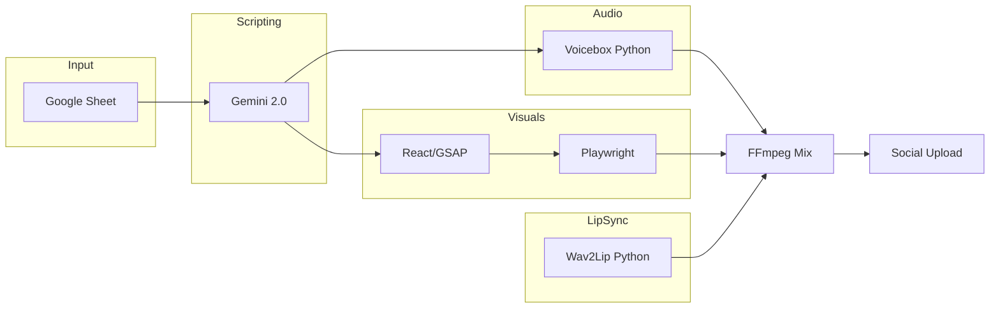

# 🎬 AI Content Automation Prototype (Dreams Pipeline)

This project is a high-fidelity technical prototype for a multi-agent AI video production pipeline. It automates the transition from structured data (Google Sheets) to fully realized, lip-synced vertical educational reels using a hybrid Node.js/Python architecture.

> [!NOTE]
> This is a **technical prototype** for experimentation. It documents the feasibility of zero-shot voice cloning and programmatic motion graphics in a cloud-automated environment.

---

## 🏗️ Technical Architecture & Lifecycle

The pipeline is orchestrated by a central Node.js process that manages the lifecycle of each "task" (video generation).

### The Automation Flow
1. **Ingestion**: `main_automation.js` polls a Google Sheet via Service Account.
2. **Scripting**: Gemini 2.0 Flash generates a 140-160 word technical script with natural rhythmic pacing and punctuation for synthesized pauses.
3. **Voice Cloning**: The script is sent to the `voicebox` (Python/Torch) service, which performs zero-shot cloning using a 30s reference (`Base-audio.mp3`).
4. **Graphic Composition**: `scriptService.js` generates a visual storyboard. `reel-composer` (React/GSAP) renders this as a dynamic HTML5 animation.
5. **Neural Lip-Sync**: The synthesized audio and the "actor" video (`Base-vedio.mp4`) are processed by `wav2lip` (Python/GAN) to animate the mouth region.
6. **Rendering**: Playwright captures the high-fidelity (50Mbps) canvas animation from the local React server.
7. **FFmpeg Merge**: Final audio (Narrative + BGM + Normalization) is mixed with the lip-sync video and technical overlays.
8. **Deployment**: The final MP4 is uploaded to YouTube, Instagram, and Facebook via respective Graph and OAuth2 APIs.



---

## 🛠️ Project Setup Guide

### 1. Prerequisites
- **Node.js**: v20 or higher.
- **Python**: 3.10.x (Essential for Torch/Transformers compatibility).
- **FFmpeg**: System path installation required.
- **Hardware**: 16GB RAM minimum. NVIDIA GPU (8GB+ VRAM) is highly recommended for reasonable local speeds.

### 2. Service Account & API Setup
- **Google Cloud**:
  1. Create a project in [Google Cloud Console](https://console.cloud.google.com/).
  2. Enable **Google Sheets API** and **YouTube Data API v3**.
  3. Create a **Service Account**, download the JSON key, and paste it into `GOOGLE_CREDENTIALS` in `.env`.
- **Meta Developers**:
  1. Register an app in the [Meta For Developers](https://developers.facebook.com/) portal.
  2. Add **Facebook Login** and **Instagram Graph API**.
  3. Use the **Graph API Explorer** to generate a Long-Lived Page Access Token for `FACEBOOK_ACCESS_TOKEN`.
- **YouTube OAuth**:
  1. Create OAuth 2.0 Client IDs in Google Cloud.
  2. Use the provided utility `bin/test_oauth2_youtube.js` to generate a `YOUTUBE_REFRESH_TOKEN`.

---

## 🔑 Environment Variable Reference (.env)

| Key | Purpose | Example/Default |
| :--- | :--- | :--- |
| `GEMINI_API_KEY` | Primary LLM engine for scripting/visuals | `AIza...` |
| `GOOGLE_SHEET_ID` | The ID of your content tracking spreadsheet | `1-BkP4...` |
| `FACEBOOK_PAGE_ID` | Numeric ID of your target FB Page | `7909...` |
| `INSTAGRAM_ACCOUNT_ID` | Numeric ID of the linked IG Business account | `1784...` |
| `VOICEBOX_MODEL_SIZE` | Size of the TTS model to load | `1.7B` |
| `FORCE_CPU` | Set to `true` to skip CUDA if local GPU is missing | `true` |
| `DANGER_ZONE_UNLOCK` | Safety flag for `bin/mass_cleanup.js` | `false` |
| `SUPABASE_URL` | Cloud storage for video artifact backup | `https://...` |

---

## 📂 Directory Structure

```text
├── main_automation.js      # The Brain (Central Orchestrator)
├── bin/                    # Dev utilities (Cleanup, OAuth testing, Diagnostics)
├── voicebox/               # Python/Torch Voice Cloning backend
│   └── backend/            # FastAPI wrappers for zero-shot synthesis
├── wav2lip/                # Neural Lip-sync GAN (Python)
├── reel-composer/          # React/Vite/GSAP Visual engine
│   └── src/services/       # geminiService.ts (Visual generation logic)
├── src/                    # Core Logic
│   ├── services/           # scriptService.js, audioService.js, etc.
│   └── config/             # Logger and environment settings
└── final_video/            # Output directory for rendered reels
```

---

## 📐 Design Decisions & Rationale

- **Headless Capture (Playwright)**: We use Playwright to record a React/GSAP frontend because it allows for high-precision, frame-perfect recording of CSS/JS animations that traditional video editors cannot easily reproduce programmatically.
- **GSAP Staging**: Animations are "Staged." GSAP seek logic is synchronized with the audio duration to ensure technical callouts appear exactly when the narrator mentions them.
- **Single-Pass Audio**: We avoid chunked audio generation to prevent "vocal jitter" (changes in tone/pitch between sentences). Generating 60s in one pass preserves the cloned voice's emotional consistency.
- **Anti-Collision Math**: Visual prompts use coordinate-based instructions (e.g., "Box A at left: 20%") to prevent overlapping elements, a common failure point in generative layouts.

---

## 🔮 Future Roadmap

- **GFPGAN Integration**: Add a face-restoration pass to the `wav2lip` output to sharpen lip regions in 4K renders.
- **Auto-Trending Hot-Swap**: Integration with TikTok trends API to automatically adjust BGM and pacing based on current viral audio patterns.
- **Semantic Scene Parsing**: Moving beyond a single "Visual Storyboard" to a multi-scene architecture where the background environment changes based on the script's intent.

---
